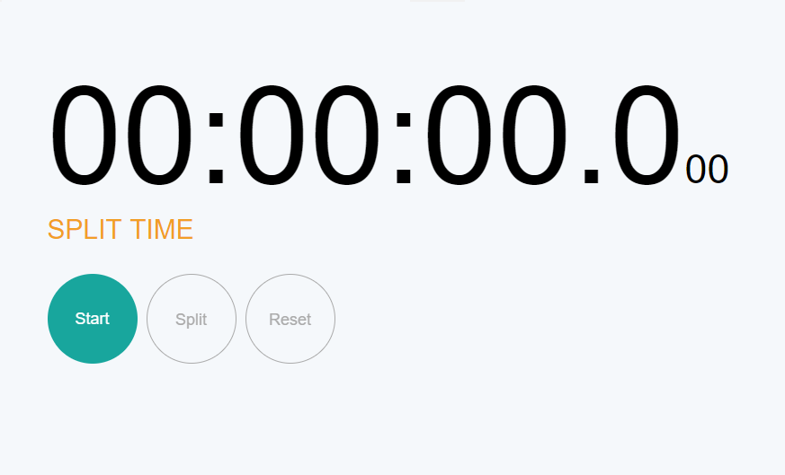
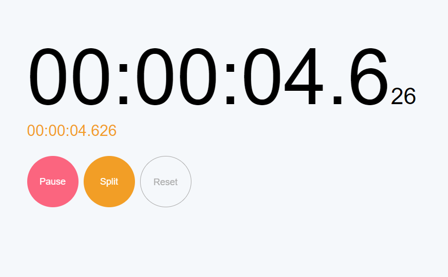

# stop-watch
## Initial State:

## Functionality:
> ### Start
> Click event on start button will start stopwatch from the current time.  
> Start button will be transformed to pause button.  
> It will enable the split button and disable reset button.  

> ### Pause
> Click event on pause button will pause the stopwatch.  
> Pause button will be transformed back to start button.  
> It will enable the reset button and disable split button.  
> This event add an entery in the log table with pause event and with the time of event triggred.  

> ### Split
> User click on split button to split the event at that time.  
> This event add an entery in the log table with split event and with the time of event triggred.  

> ### Reset
> User click on reset button to bring stopwatch to initial state.  

## Screenshots:

