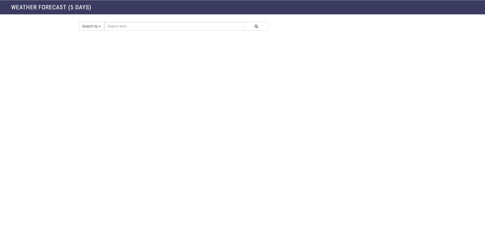
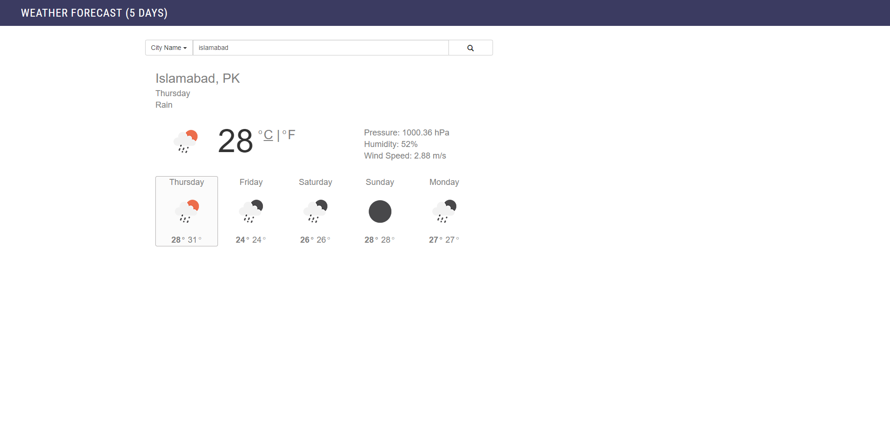

# weather-api

## API [openweather](https://openweathermap.org/forecast5)
## Key
>key = 'c73aa228bfba692462f96e89080aa39a'   
>In case of key is not working or invalid, you can create your own key by subscribing [openweatherApi](https://openweathermap.org/price).

## Search By
> ### City Name
> http://api.openweathermap.org/data/2.5/forecast?q=${cityName}&units=metric&appid=${key}
> ###### Parameters
>* City Name e.g Islamabad
>* Key
>* Unit (optional)  

> ### Zip Code
> http://api.openweathermap.org/data/2.5/forecast?id=${zipCode}&units=metric&appid=${key}
> ###### Parameters
>* Zip Code e.g 44000,pk
>* Key
>* Unit (optional)  

> ### Geographic Coordinates
> http://api.openweathermap.org/data/2.5/forecast?lat={latitudes}&lon={longitudes}&units=metric&appid=${key}
> ###### Parameters
>* Latitudes
>* Longitudes
>* Key
>* Unit (optional)  

## Response
### JSON 
```json
{"city":{"id":1851632,"name":"Shuzenji",
"coord":{"lon":138.933334,"lat":34.966671},
"country":"JP",
"timezone": 32400,
"cod":"200",
"message":0.0045,
"cnt":38,
"list":[{
        "dt":1406106000,
        "main":{
            "temp":298.77,
            "temp_min":298.77,
            "temp_max":298.774,
            "pressure":1005.93,
            "sea_level":1018.18,
            "grnd_level":1005.93,
            "humidity":87,
            "temp_kf":0.26},
        "weather":[{"id":804,"main":"Clouds","description":"overcast clouds","icon":"04d"}],
        "clouds":{"all":88},
        "wind":{"speed":5.71,"deg":229.501},
        "sys":{"pod":"d"},
        "dt_txt":"2014-07-23 09:00:00"}
        ]}
````   

### XML
````xml

<lastupdate/>
 <calctime>0.6543</calctime>
 <nextupdate/>
</meta>
<sun rise="2015-06-30T10:08:46" set="2015-07-01T01:06:20"/>
<forecast>
 <time from="2015-06-30T09:00:00" to="2015-06-30T12:00:00">
 <symbol number="500" name="light rain" var="10n"/>
 <precipitation value="5" unit="3h" type="rain"/>
 <windDirection deg="253.5" code="WSW" name="West-southwest"/>
 <windSpeed mps="4.9" name="Gentle Breeze"/>
 <temperature unit="celsius" value="16.89" min="16.89" max="17.375"/>
 <pressure unit="hPa" value="989.51"/>
 <humidity value="96" unit="%"/>
 <clouds value="broken clouds" all="64" unit="%"/>
</time>
 <time from="2015-06-30T12:00:00" to="2015-06-30T15:00:00">
 <symbol number="500" name="light rain" var="10d"/>
 <precipitation value="99" unit="3h" type="rain"/>
 <windDirection deg="248.001" code="WSW" name="West-southwest"/>
 <windSpeed mps="4.86" name="Gentle Breeze"/>
 <temperature unit="celsius" value="17.23" min="17.23" max="17.614"/>
 <pressure unit="hPa" value="991.29"/>
 <humidity value="97" unit="%"/>
 <clouds value="scattered clouds" all="44" unit="%"/>
 </time>

...

</forecast>
</weatherdata>
````

## Functionality

-		user can view temprature both in centigrade and farenhite  
-		user can switch between days to get detailed temprature of that day  
-		each section of per day temprature show min max temprature of day  
-		relavent images/icons will show the weather condition  
-		area chart will show the complete temprature of a day with an interval of 3 hour  

### Screenshots







